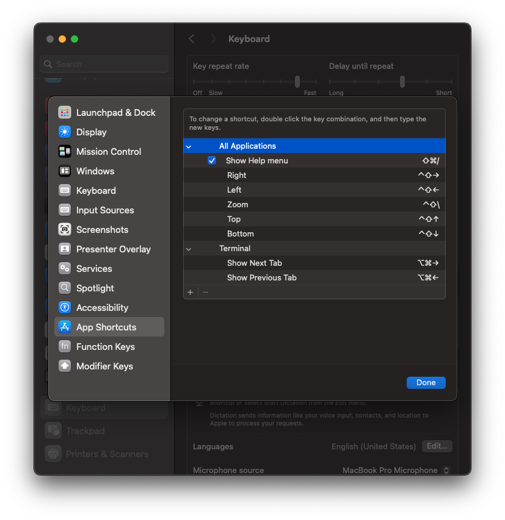

# macOS Initial Setup

## 1. Configure SSH with ed25519

```bash
# Generate ed25519 key
ssh-keygen -t ed25519 -C "your_email@example.com"

# Start the ssh-agent
eval "$(ssh-agent -s)"

# Add key to ssh-agent
ssh-add ~/.ssh/id_ed25519

# Copy public key to clipboard
pbcopy < ~/.ssh/id_ed25519.pub
```

Add the copied key to your GitHub or GitLab account.

---

## 2. Install Homebrew

```bash
/bin/bash -c "$(curl -fsSL https://raw.githubusercontent.com/Homebrew/install/HEAD/install.sh)"
```

After installation:

```bash
echo 'eval "$(/opt/homebrew/bin/brew shellenv)"' >> ~/.zprofile
eval "$(/opt/homebrew/bin/brew shellenv)"
```

---

## 3. Keyboard Shortcuts (App Shortcuts)

Go to: **System Settings → Keyboard → Keyboard Shortcuts → App Shortcuts**.
Add the following:

* **All Applications**
  * Show Help menu, Zoom, Top, Bottom, Left, Right

* **Terminal**
  * Show Next Tab, Show Previous Tab



---

## 4. Swap Caps Lock and Control

Go to: **System Settings → Keyboard → Keyboard Shortcuts → Modifier Keys**.
Set:

* Caps Lock → Control
* Control → Caps Lock (optional, if needed)

---

## 5. Display Sleep Settings

Go to: **System Settings → Display → Advanced → Energy**

* When charger is connected → **Never sleep**
* When on battery → **Sleep after 5 minutes**

---

## 6. Install clang

```bash
brew install llvm
```

Ensure `clang` is available:

```bash
clang --version
```

---

## 7. Install and Configure GitHub

```bash
brew install git

# Configure Git identity
git config --global user.name "Your Name"
git config --global user.email "your_email@example.com"
```

---

## 8. Install VSCode

```bash
brew install --cask visual-studio-code
```

---

## 9. Install Android Studio

```bash
brew install --cask android-studio
```

---

## 10. Install Docker

```bash
brew install --cask docker
```

Launch Docker.app once after installation.

---

## 11. Install Netron

```bash
brew install --cask netron
```

---

## 12. Install Rosetta

```bash
softwareupdate --install-rosetta --agree-to-license
```

## 13. iCloud Symlink

```bash
ln -s ~/Library/Mobile\ Documents/com\~apple\~CloudDocs ~/iCloud
```
