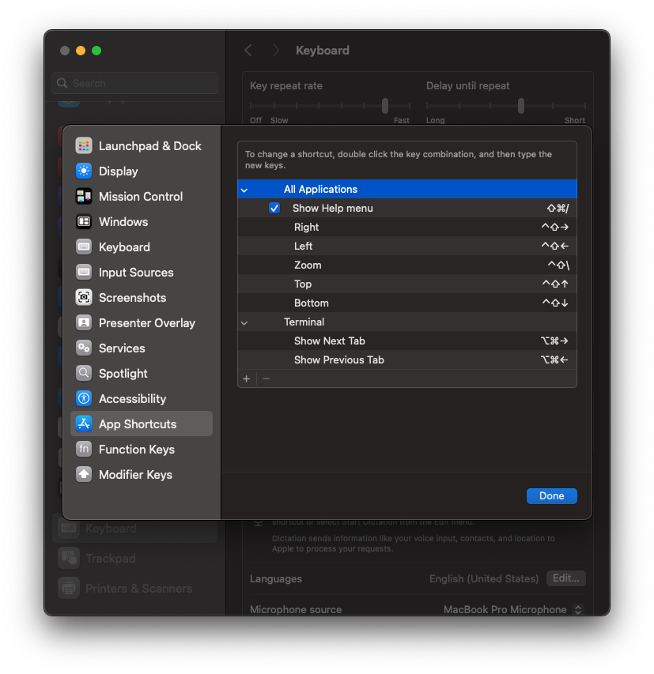

# macOS Initial Setup

## 1. Configure SSH with ed25519

```bash
# Generate ed25519 key
ssh-keygen -t ed25519 -C "your_email@example.com"

# Start the ssh-agent
eval "$(ssh-agent -s)"

# Add key to ssh-agent
ssh-add ~/.ssh/id_ed25519

# Copy public key to clipboard
pbcopy < ~/.ssh/id_ed25519.pub
```

Add the copied key to your GitHub or GitLab account.

---

## 2. Install Homebrew

```bash
/bin/bash -c "$(curl -fsSL https://raw.githubusercontent.com/Homebrew/install/HEAD/install.sh)"
```

After installation:

```bash
echo 'eval "$(/opt/homebrew/bin/brew shellenv)"' >> ~/.zprofile
eval "$(/opt/homebrew/bin/brew shellenv)"
```

---

## 3. Keyboard Shortcuts (App Shortcuts)

Go to: **System Settings -> Keyboard -> Keyboard Shortcuts -> App Shortcuts**. Add the following:

- **All Applications**: Show Help menu, Zoom, Top, Bottom, Left, Right
- **Terminal**: Show Next Tab, Show Previous Tab



---

## 4. Swap Caps Lock and Control

Go to: **System Settings -> Keyboard -> Keyboard Shortcuts -> Modifier Keys**. Set:

- Caps Lock -> Control
- Control -> Caps Lock (optional, if needed)

---

## 5. Display Sleep Settings

Go to: **System Settings -> Display -> Advanced -> Energy**.

- When charger is connected -> **Never sleep**
- When on battery -> **Sleep after 5 minutes**

---

## 6. Install clang

```bash
brew install llvm
```

Ensure `clang` is available:

```bash
clang --version
```

---

## 7. Install and Configure GitHub

```bash
brew install git

# Configure Git identity
git config --global user.name "Your Name"
git config --global user.email "your_email@example.com"
```

---

## 8. Install VSCode

```bash
brew install --cask visual-studio-code
```

---

## 9. Install Android Studio

```bash
brew install --cask android-studio
```

---

## 10. Install Docker

```bash
brew install --cask docker
```

Launch Docker.app once after installation.

---

## 11. Install Netron

```bash
brew install --cask netron
```

---

## 12. Install Rosetta

```bash
softwareupdate --install-rosetta --agree-to-license
```

---

## 13. iCloud Symlink

```bash
ln -s ~/Library/Mobile\ Documents/com\~apple\~CloudDocs ~/iCloud
```

---

## 14. tmux

```bash
brew install tmux
```

### tmux Session Persistence

Persist tmux sessions across reboots using **tmux-resurrect** (save/restore) and **tmux-continuum** (auto-save, auto-restore, auto-start on boot), managed by **TPM**.

- Survives a reboot: sessions, windows, panes, layout, per-pane working directory, visible pane contents.
- Does *not* survive: programs running inside panes (e.g. `claude`, Jenkins, scripts). Panes reopen, but you must re-run the program.

#### 1. Installation (one-time)

1. Install TPM (plugin manager):

    ```bash
    git clone https://github.com/tmux-plugins/tpm ~/.tmux/plugins/tpm
    ```

2. Add to `~/.tmux.conf` (see the provided `.tmux.conf`):

    ```tmux
    set -g @plugin 'tmux-plugins/tpm'
    set -g @plugin 'tmux-plugins/tmux-resurrect'
    set -g @plugin 'tmux-plugins/tmux-continuum'   # keep continuum LAST
    set -g @resurrect-capture-pane-contents 'on'
    set -g @continuum-restore 'on'
    set -g @continuum-boot 'on'
    run '~/.tmux/plugins/tpm/tpm'                  # keep this at the very bottom
    ```

3. Install the plugins (downloads resurrect + continuum):

    ```bash
    ~/.tmux/plugins/tpm/bin/install_plugins
    ```

    - Alternative: inside tmux, press `prefix + I` (default prefix `Ctrl-b`).
    - `tmux source-file` only reloads config; it does *not* download plugins.

4. Reload config into the running server:

    ```bash
    tmux source-file ~/.tmux.conf
    ```

5. Create an initial save (so the first reboot has something to restore):

    ```bash
    ~/.tmux/plugins/tmux-resurrect/scripts/save.sh
    ```

    - Alternative: inside tmux, press `prefix + Ctrl-s`.

6. First reboot only: if macOS prompts for System Events control, allow it under System Settings -> Privacy & Security -> Accessibility, or auto-start fails.

#### 2. Usage

##### Restore after a reboot

- Automatic: on login, launchd starts tmux and continuum restores the last save. Just attach:

    ```bash
    tmux ls
    tmux attach -t <session-name>
    ```

- Manual (only if auto-restore didn't run):
  - Inside tmux: `prefix + Ctrl-r`
  - From a shell:

    ```bash
    ~/.tmux/plugins/tmux-resurrect/scripts/restore.sh
    ```

- Auto-restore runs only on server start, and is skipped if a tmux server is already running. Let boot auto-start handle it -- don't start tmux manually first.

##### Save

- Automatic: every 15 min, plus immediately on new-session creation (`session-created` hook).
- Manual: `prefix + Ctrl-s`.

##### Verify the latest save

```bash
DIR="${XDG_DATA_HOME:-$HOME/.local/share}/tmux/resurrect"
[ -d "$DIR" ] || DIR="$HOME/.tmux/resurrect"
ls -la "$DIR"                                            # expect 'last' + tmux_resurrect_*.txt
awk -F '\t' '$1=="pane"{print $2}' "$DIR/last" | sort -u | wc -l   # session count
```

#### 3. Notes & tuning

- Auto-save interval (minutes): `set -g @continuum-save-interval '5'` (`0` disables auto-save).
- Temporarily disable auto-restore: `touch ~/tmux_no_auto_restore` (delete to re-enable).
- Auto-restart specific programs on restore: `set -g @resurrect-processes 'ssh psql "~vim"'`.
- Default prefix `Ctrl-b`. Save = `prefix + Ctrl-s`, Restore = `prefix + Ctrl-r`.
- Keep `tmux-continuum` last; a theme plugin that overwrites `status-right` after it silently stops auto-save.
